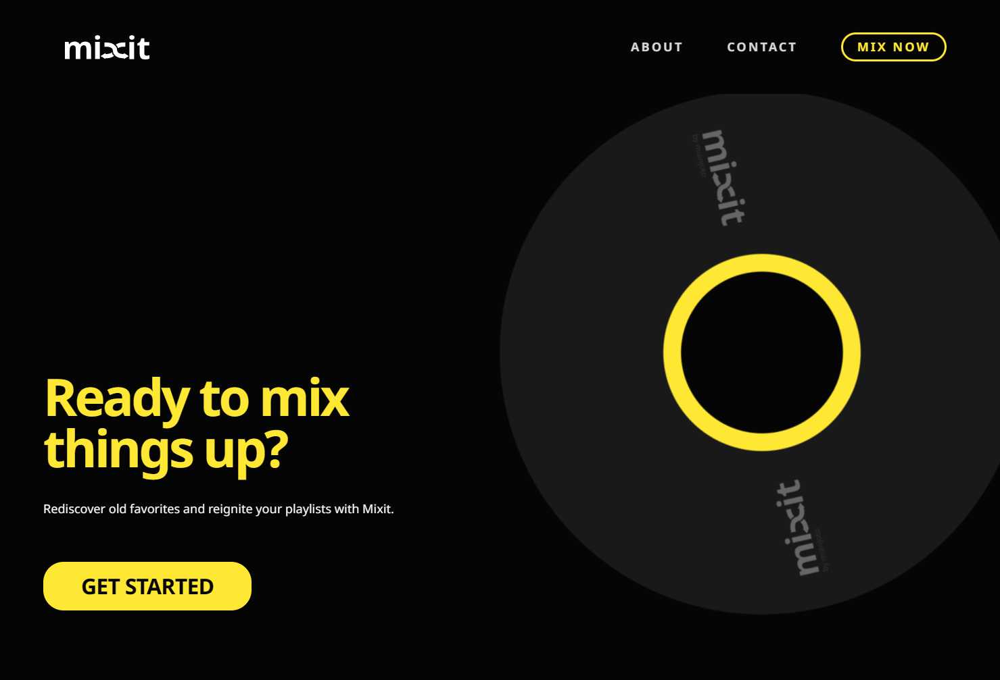
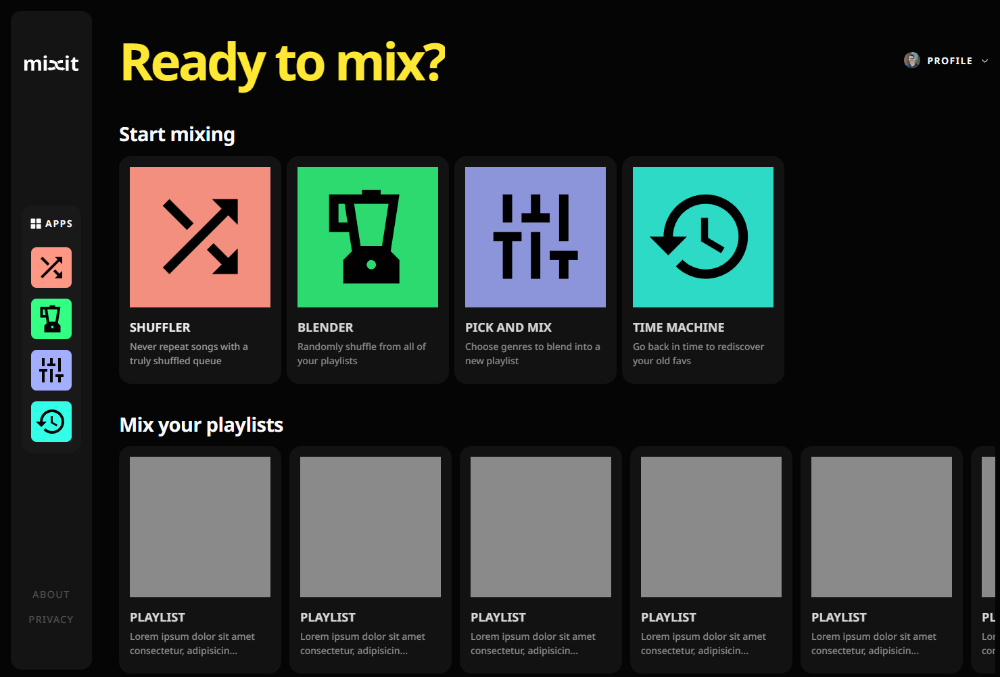
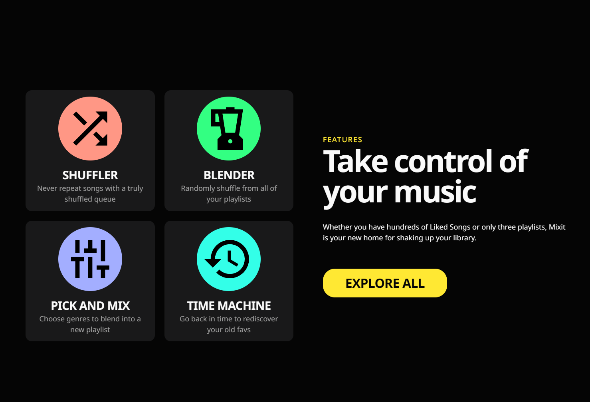
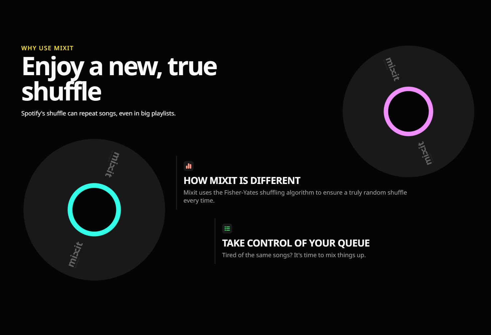
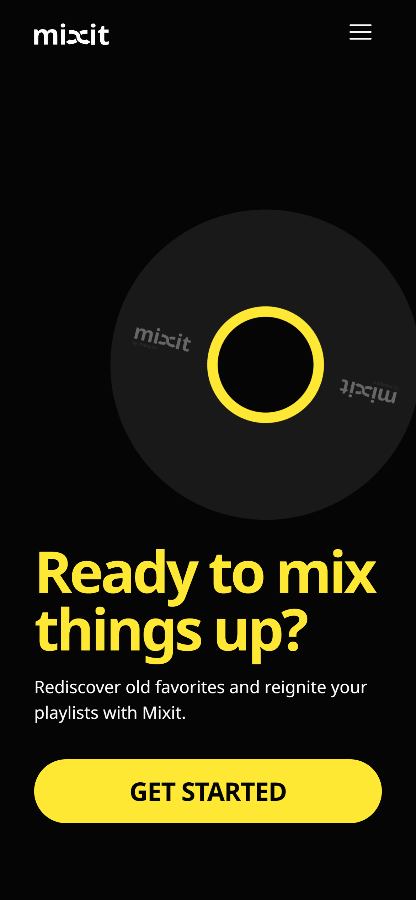
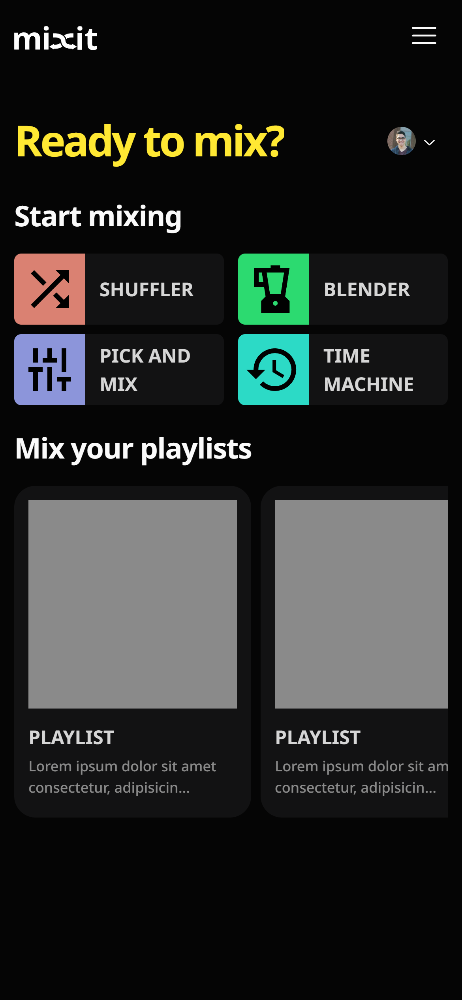
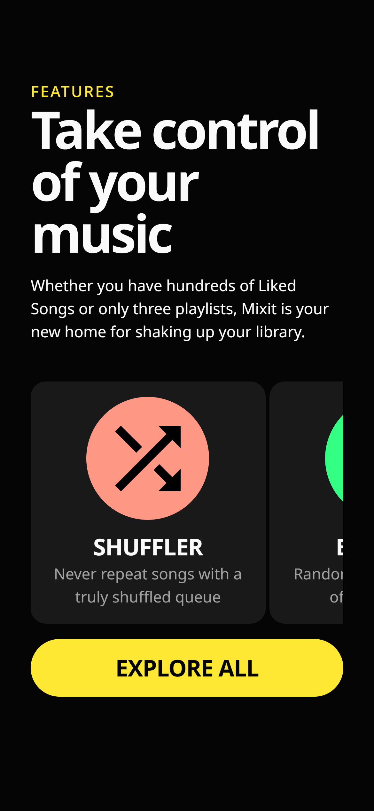
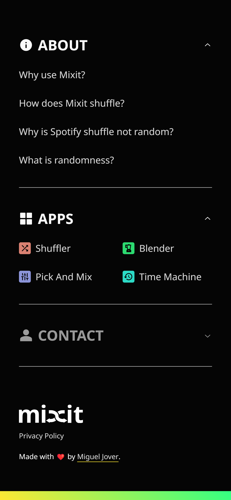

<p align="center"/>
    <a href="https://github.com/mianjoto/mixit">
        
    </a>
    <p align="center">Expand your Spotify experience.</p>
    <p align="center">
        <a href="#features">Features</a> ·
        <a href="#screenshots">Screenshots</a> ·
        <a href="https://github.com/mianjoto/mixit/pulls?q=is%3Apr">Changelog</a> ·
        <a href="#contact">Contact</a>
    </p>
    
</header>

# Mixit

Mixit is a dashboard of tools for Spotify that shuffles songs and playlists to create unique mixes.

From a truly random shuffle to genre-specific recommendations, Mixit is your new home for a new Spotify experience.

## Features

Tired of the same songs playing when shuffling in Spotify? Try out Mixit's apps—you're sure to find something great:

<table>
  <tr>
    <td style="padding: 1rem;">
        <div style="display: flex; gap: 1rem; align-items: center; align-content: center;">
            
        <section>
        <h3>Shuffler</h3>Never repeat songs with a truly shuffled queue
        </section>
        </div>
    </td>
    <td style="padding: 1rem;">
        <div style="display: flex; gap: 1rem; align-items: center; align-content: center;">
            
        <section>
        <h3>Blender</h3>Randomly shuffle from all of your playlists
        </section>
        </div>
    </td>

  </tr>
  <tr>

  <td style="padding: 1rem;">
        <div style="display: flex; gap: 1rem; align-items: center; align-content: center;">
            
        <section>
        <h3>Pick And Mix</h3>Choose genres to blend into a new playlist
        </section>
        </div>
    </td>
    <td style="padding: 1rem;">
        <div style="display: flex; gap: 1rem; align-items: center; align-content: center;">
            
        <section>
        <h3>Time Machine</h3>Go back in time to rediscover your old favorites
        </section>
        </div>
    </td>
  </tr>
</table>

## Screenshots






<details>
  <summary>

### Mobile version:

  </summary>






</details>

> Note: Design, layout, and features are subject to change. These screenshots may not be representative of the final product.

## Usage

### Prerequisites

- [Node.js](https://nodejs.org/en/) (v18.13.0 or later)
- [Yarn package manager](https://yarnpkg.com/) (v1.22.19 or later)

### Installation

Install steps:

```
git clone https://github.com/mianjoto/mixit
yarn install
```

### Run Locally

```
yarn run dev
```

## Technologies used

Languages:

- Full-stack TypeScript

Frontend:

- React.js/Next.js v13, TailwindCSS,

Backend:

- Next.js v13, NextAuth

## Contact

<p align="center">
    <a href="https:/github.com/mianjoto"></a>
    <p align="center">Solo developed by <a href="https://github.com/mianjoto"><strong>Miguel Jover</strong></a></p>
    <p align="center">Want to get in contact?</br>Send me an email at <a href="mailto:mianjoto@gmail.com"><strong>mianjoto@gmail.com</strong></a></p>

---

   <p align="center">Project Link: <a href="https://github.com/mianjoto/mixit">https://github.com/mianjoto/mixit</a></p>

</p>
